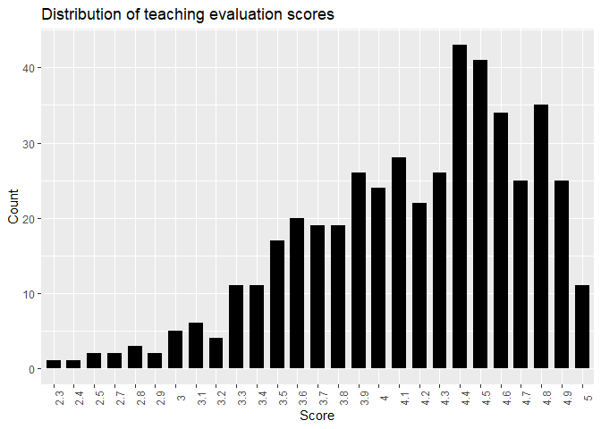
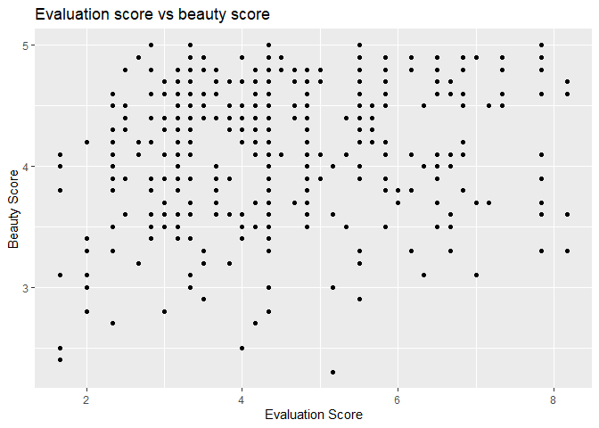
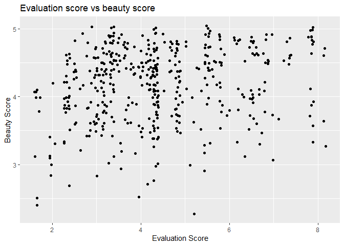

Lab 09 - Grading the professor, Pt. 1
================
Lindley Slipetz
03/30/2021

### Load packages and data

``` r
#install.packages("vctrs")
#install.packages("tibble")
#install.packages("tidyverse")
library(tidyverse) 
#install.packages("broom")
#install.packages("tidymodels")
#install.packages("ggplot2")
library(tidymodels)
library(openintro)
```

Okay, loading tidymodels ended up being kind of a nightmare, but now
we’re ready to go.

### Exercise 1

``` r
ggplot(evals, aes(x=factor(score)))+
  geom_bar(stat="count", width=0.7, fill="black")+
  labs(x = "Score", y = "Count", title = "Distribution of teaching evaluation scores") +
  theme(axis.text.x = element_text(angle = 90))
```

<!-- -->

``` r
evals %>%
  summarise(averageRating = mean(score),
             sdRating = sd(score))
```

    ## # A tibble: 1 x 2
    ##   averageRating sdRating
    ##           <dbl>    <dbl>
    ## 1          4.17    0.544

The distribution is positively skewed. Students tend to rate their
courses highly. The average score is 4.17 with a standard deviation of
0.54. I’m actually a bit surprised by this, but I would explain it by my
perception of the gender disparity in evaluations (of course, I’m going
to evaluate that later, so maybe this will change). Men tend to get high
scores and there’s more male professors than female professors, so that
would skew the distribution.

### Exercise 2

``` r
ggplot(evals, aes(x=score, y=bty_avg)) +
  geom_point() +
  labs(x = "Evaluation Score", y = "Beauty Score", title = "Evaluation score vs beauty score") 
```

<!-- -->

While it does seem true that, generally, higher beauty score is
associated with higher evaluations (because the higher beauty scores are
associated with higher evaluations), it’s not a strong association.

### Exercise 3

``` r
ggplot(evals, aes(x=score, y=bty_avg)) +
  geom_jitter() +
  labs(x = "Evaluation Score", y = "Beauty Score", title = "Evaluation score vs beauty score") 
```

<!-- -->

Jitter makes it so the points aren’t in straight lines. It makes it more
clear that there might be a linear relationship between evaluation score
and beauty score.

``` r
lm_model <- linear_reg() %>% 
            set_engine('lm') %>% 
            set_mode('regression')
lm_fit <- lm_model %>% 
          fit(score ~ bty_avg, data = evals)
lm_fit
```

    ## parsnip model object
    ## 
    ## Fit time:  0ms 
    ## 
    ## Call:
    ## stats::lm(formula = score ~ bty_avg, data = data)
    ## 
    ## Coefficients:
    ## (Intercept)      bty_avg  
    ##     3.88034      0.06664

**Regression model**: score = 0.6664bty\_avg + 3.88034
